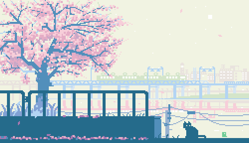
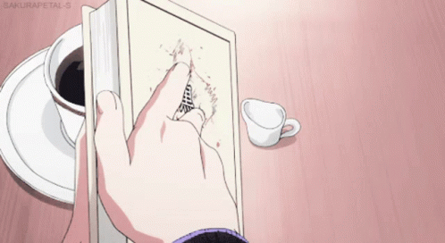

  

<h1 align="center">Hi, I'm GuMengSama!</h1>

<h2 align="center">Welcome to my GitHub profile~</h2>

<h2 align="center">~🍓 𝓐𝓫𝓸𝓾𝓽 𝓶𝓮 🍓~</h2>

* <b>Nickname:</b> GuMengSama
* <b>Loves:</b> Anime, Moba Games
* <b>Gender:</b> Male
* <b>Country:</b>Chin

      

<h2 align="center">~ 📇 𝓚𝓷𝓸𝔀𝓵𝓮𝓭𝓰𝓮 📇 ~</h2>

         I am improving myself as a CS student at Tianjin University now~

        

<h2 align="center">~💞 𝓣𝓱𝓪𝓷𝓴𝓼 𝓯𝓸𝓻 𝓡𝓮𝓪𝓭𝓲𝓷𝓰 💞~</h2>

